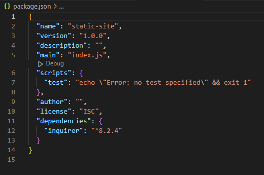
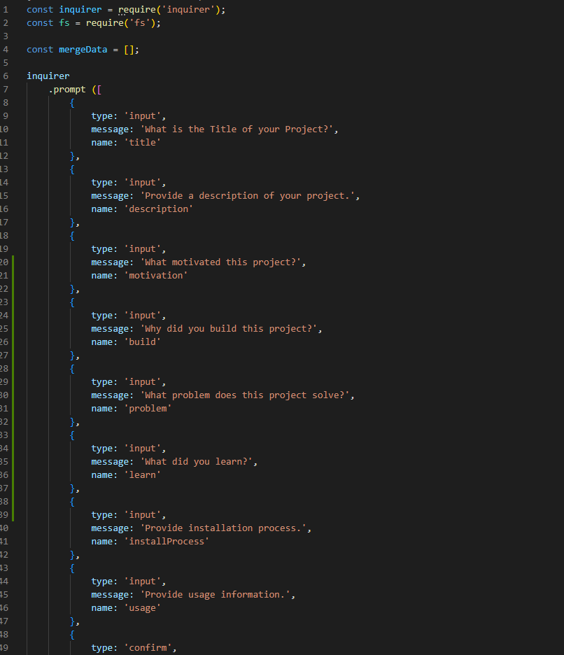
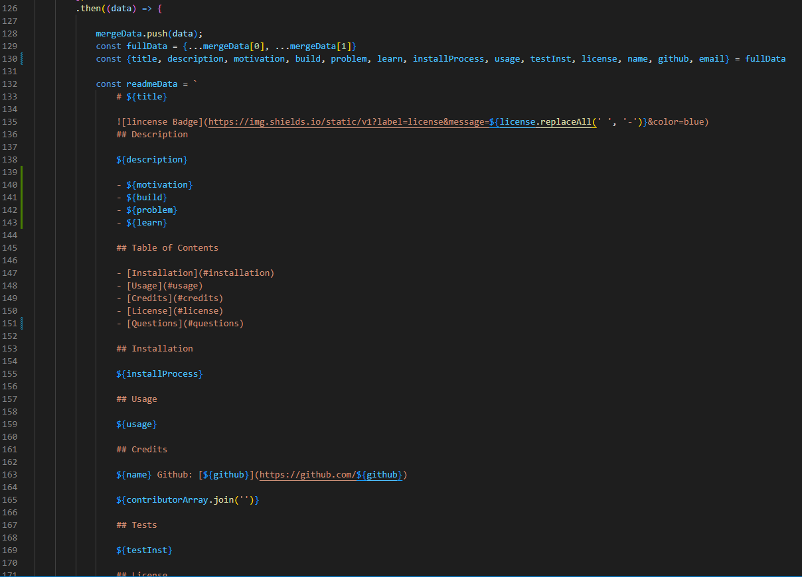
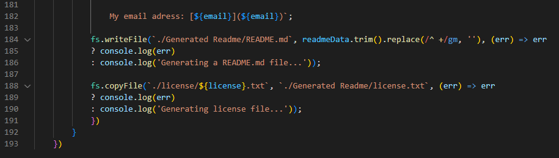

# 09 Node.js Challenge: Professional README Generator

## Video Demonstration

## Task

```md
My task was to create a node.js application that uses inquirer, in order to create prompts that will be used to generate a README file.
In order to create that README file after all the prompts have been answered, I had to use fs in order to write the file into the Generated Readme folder.
While also using fs to make a copy of the license.txt file that contains more info on the license being used for the repo.

```
## The Code

The main part of the code is going to be using inquirer to just get the prompts working. 
First I have to do an install of inquirer by creating a package.json file that contains the code needed to run an 'npm i' command for inquirer 8.2.4



Once installed, I began writing the code to get inquirer installed by creating a variable

    const inquirer = require('inquirer');

With that const created, i was able to begin using inquirer.
I started by doing the simple prompts needed, to just get the prompts to work through the terminal.



At one point the user will be asked about other contributors, so in order to keep adding as many contributors as there are, the user is put in a loops
asking the user for the names and the github username until there are no more. 

Everytime it loops, it adds a string into an array called contributorArray, that will be used later on to populate the readme with all the contributors.

Before the user jumps into the contributor loop, the data from the previous promps is thrown into an array as an object since we will be creating another data object once we jump back into the rest of the prompts.

If the user says there are no more contributors, the continuePromps() function executes and skips over the loop.

After the last of the prompts have been answered. the data from the second set of prompts gets merged together through a spread operator into a single const variable.
Since both data variables were objects, the merge turns them into a single object, and then an object deconstructor is used to get all the variables in the object and from there I took a basic readme layout and began pluging in the variables into the appropiate section.



Last thing was to use 'fs' to give me the access to the users system, to generate the readme and license into the Generated Readme folder.
In order to get access to 'fs' I needed to add the following line of code under the inquirer code at the top of the js file:

    const fs = require('fs');

By using fs.writeFile, that will take all the data in the readmeData variable with all the answers in the readme layout. and generate it in the path put in.
Using .trim().replace(/^ +/gm, '') we remove all the blank space before the first line in the readme, and the replace removes all the indentation added from indenting the readme layout in the code itself, or else the readme will generate indented how it is in the code. The main reason to add this is purely to keep the code lookng nice and organized. Removing the indentation in the code itself, will yield the same result.

The fs.copyFile, is just taking one of the license.txt files in the license folder and creating a copy that goes along the README file to coincide with the license that the user has said they are using in the prompts. 



## User Story

```md
AS A developer
I WANT a README generator
SO THAT I can quickly create a professional README for a new project
```

## Acceptance Criteria

```md
GIVEN a command-line application that accepts user input
WHEN I am prompted for information about my application repository
THEN a high-quality, professional README.md is generated with the title of my project and sections entitled Description, Table of Contents, Installation, Usage, License, Contributing, Tests, and Questions
WHEN I enter my project title
THEN this is displayed as the title of the README
WHEN I enter a description, installation instructions, usage information, contribution guidelines, and test instructions
THEN this information is added to the sections of the README entitled Description, Installation, Usage, Contributing, and Tests
WHEN I choose a license for my application from a list of options
THEN a badge for that license is added near the top of the README and a notice is added to the section of the README entitled License that explains which license the application is covered under
WHEN I enter my GitHub username
THEN this is added to the section of the README entitled Questions, with a link to my GitHub profile
WHEN I enter my email address
THEN this is added to the section of the README entitled Questions, with instructions on how to reach me with additional questions
WHEN I click on the links in the Table of Contents
THEN I am taken to the corresponding section of the README
```
